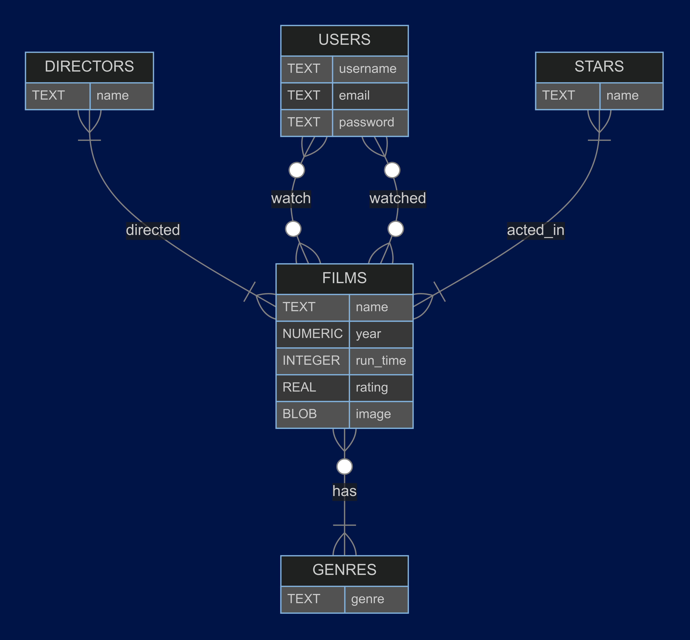

# Design Document

By Ahmed Mahmoud Abdelazim

Video overview: <URL https://youtu.be/BnxrAaGwUNQ>

## Scope

this database is for website [`movies4u`](https://movies4u.pythonanywhere.com) that me and my fried are working on to utilize a data for 10,000 movies . this database inclueds all entities necessary to facilitate the process of searching a movie , adding movie to watchlist
 and adding movie to watchedlist included in the database's scope is:

* Users , including basic identifying information
* Users , watch and wathced list
* Films , including basic identifying information like name , image , description , directors , rating , stars and genres

out of scope stars and directors identifying information
## Functional Requirements

the data base will support
* Searching a movie by name
* adding new user and his identifying infromation
* adding movie to watch list
* adding movie to wached list

## Representation
Entities are captured in SQLite tables with the following schema.
### Entities

The database includes the following entities:
### Users
the `users` tabeles inclueds
* `id` , which specifies the unique ID for the user as an `INTEGER`. This column thus has the `PRIMARY KEY` constraint applied.
* `username` ,  which specifies the username as `TEXT` . It also has a constrain `NOT NULL`.
* `email` ,  which specifies the user's email as `TEXT` . It also has a constrain `NOT NULL`.
* `password` , which specifies the user's password as `TEXT` . It also has a constrain `NOT NULL`.

### Films
the `films` tabeles inclueds
* `id` , which specifies the unique ID for the film as an `INTEGER`. This column thus has the `PRIMARY KEY` constraint applied.
* `name` , which specifies the film name  as `TEXT` .It also has a constrain `NOT NULL`.
* `year` , which specifies the film year  as `NUMERIC` . It also has a constrain `NOT NULL`.
* `run_time` , which specifies the film run time as `INTEGER`.
* `rating` which specifies the film rating as `REAL` ,
* `image` which stores the film image as `BLOB`.

### Directors
* `id` , which specifies the unique ID for the director  as an `INTEGER`. This column thus has the `PRIMARY KEY` constraint applied.
* `name` , which specifies the director name  as `TEXT` . It also has a constrain `NOT NULL`.

### Stars
* `id` , which specifies the unique ID for the star   as an `INTEGER`. This column thus has the `PRIMARY KEY` constraint applied.
* `name` , which specifies the star name  as `TEXT`.It also has a constrain `NOT NULL`.

### Genres
* `id` , which specifies the unique ID for the star   as an `INTEGER`. This column thus has the `PRIMARY KEY` constraint applied.
* `type` , which specifies the type as `TEXT` .  It also has a constrain `NOT NULL`.

### Relationships

The below entity relationship diagram describes the relationships among the entities in the database.

* There is zero to many  many watch relationship between  users and films as one film can be added to watchlist by many users and the user can add many films to their watchlist
* There is zero to many watched relationship between users and films as one film can be added to watchedlist by many users and the user can add many films to their watchedlist
* There is one to many relationship between films and stars as the film has at least one star , but it can have more and vice versa
* There is one to many relationship between films and directors as the film has at least one director , but it can have more and vice versa
* There is one to many relation ship between  films and  genres and as the film must have at least one genre on the other hand there is zero to many relation between  genre and films as one film can have many genres but I included zero as may be there is a genre that does not appear in the films table
## Optimizations

* I have made an `index` for movies (name) as it is a requirment to search the movie by its name .
* I made a `view` for both watch and watched list as this lists is frequently shown to user.
* I have mad an `index` for the users (username) as this will be heavily used to filter a specific user watch and watched list .

## Limitations

this database cannot show information for neither directors nor stars , but it is heavily used to show the watch and watched list to know the user intersets and this can be applied in many aspects . in our project `movies4u` we used it as input for machine learning model to recommend new movies for the user.
